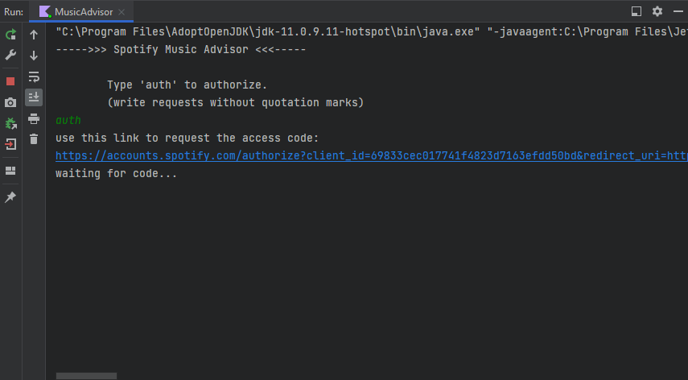
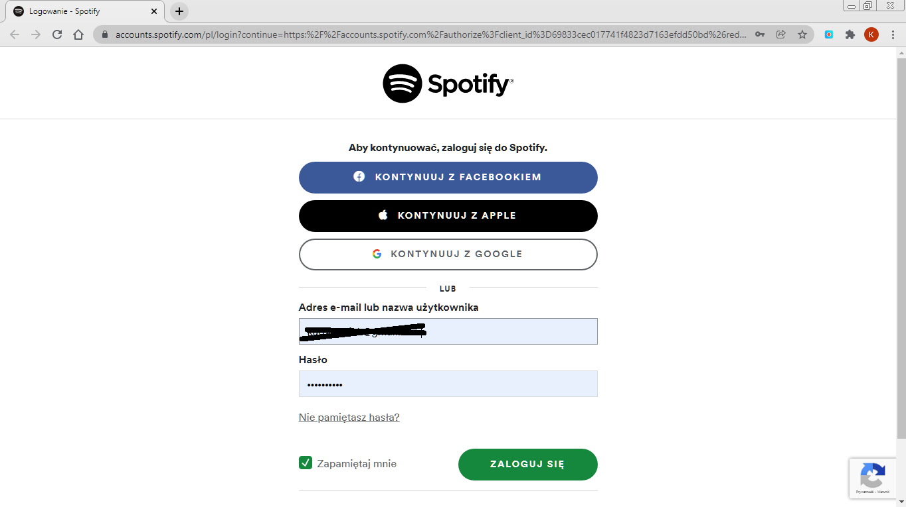
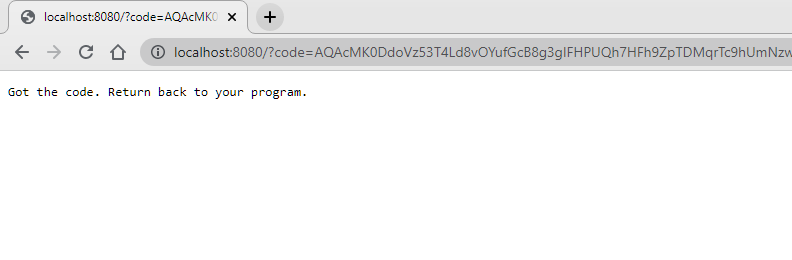
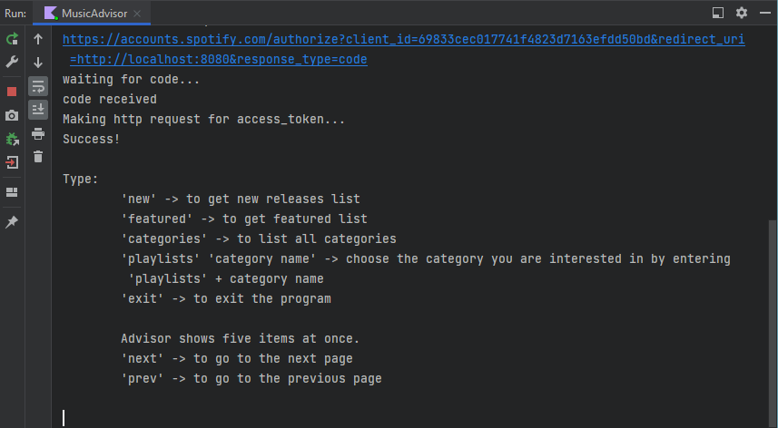
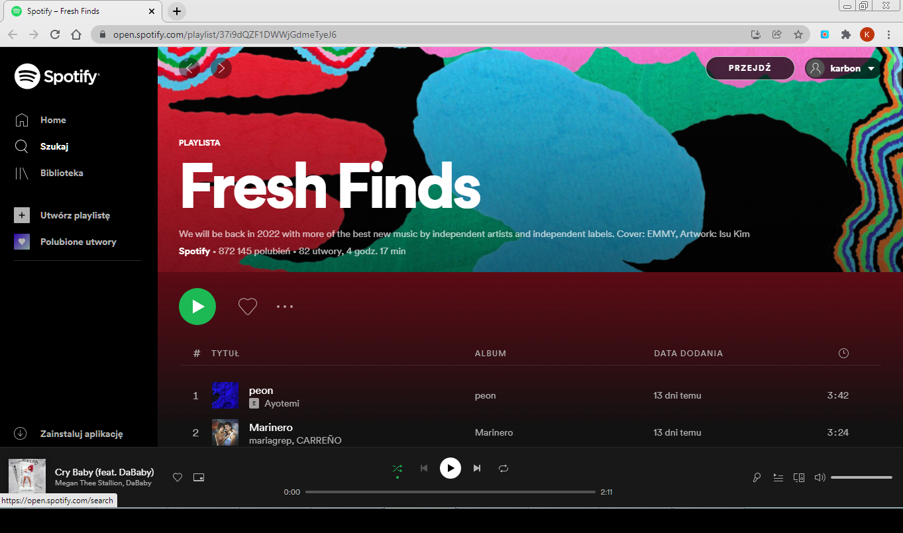
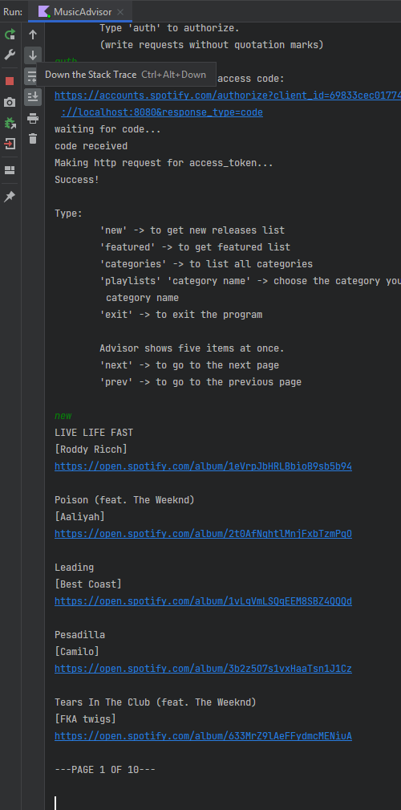
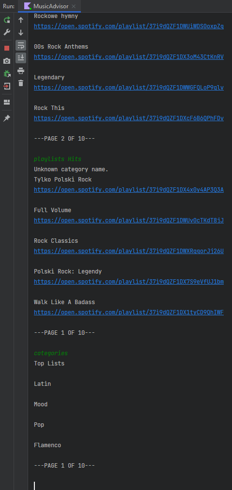
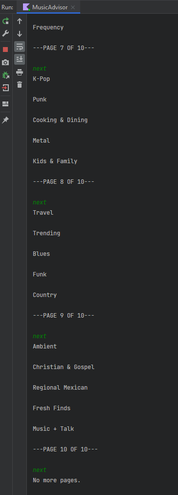
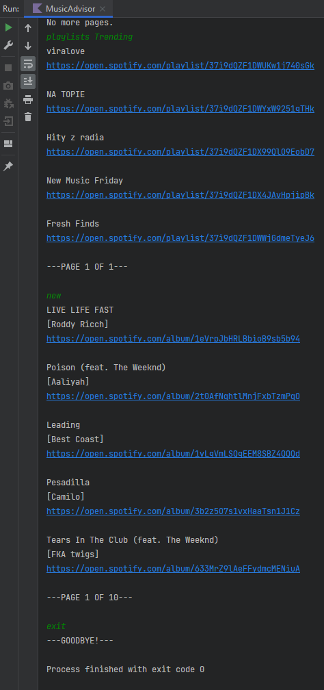

# Music Advisor 

A simple Kotlin CLI application that uses the Spotify API and allows users to securely (OAuth 2.0) 
log into their real account, send requests, and receive album/song lists according to the selected category.

## Table of contents
* [Overview](#overview)
* [Screenshots](#screenshots)
* [Technologies](#technologies)
* [How to start](#how-to-start)

## Overview
JetBrains Academy Project

An application that offers music using Spotify API.

Program read user input and provide information at the user's request.
- auth - user is redirected to the Spotify login page to confirm authorization, if it is not rejected - the access token is sent;
- featured - a list of Spotify-featured playlists with their links fetched from API;
- new - a list of new albums with artists and links on Spotify;
- categories - a list of all available categories on Spotify (just their names);
- playlists C_NAME (where C_NAME is the name of category) - the list contains playlists of this category and their links on Spotify;
- exit - shuts down the application.

## Screenshots
###### authorization
   

###### redirect from link

###### some screenshots from app
    

## Technologies
- Kotlin 1.5.1
- Gradle 7.1
- OAuth 2.0
- Gson library
- HttpClient API

## How to start

You can simply download an archive, unzip it inside the directory you want to, and open it in your IDE. 

If you want clone the repo:

- run command line in the directory you want to store the app and type the following command: 
  
``git clone https://github.com/codeofcarbon/music_advisor`` 
    
   or
    
- start with *Project from Version Control* in your IDE by providing the url of this repository.

